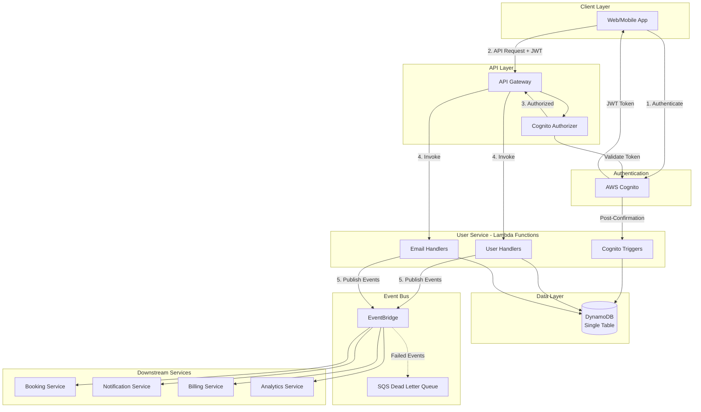

## System Overview

The User Service follows a serverless, event-driven architecture on AWS. All components are managed services, eliminating operational overhead while providing automatic scaling.

## Component Breakdown

### Client Layer

The client (web or mobile application) initiates all interactions. Authentication happens directly with Cognito, and all subsequent API calls include the JWT token.

### Authentication Layer

<CardGroup cols={2}>
  <Card title="AWS Cognito" icon="shield">
    Handles user registration, login, password reset, and MFA. Issues JWT tokens for authenticated sessions.
  </Card>
  <Card title="Cognito Authorizer" icon="check">
    Attached to API Gateway. Validates JWT signature and expiry before any Lambda invocation.
  </Card>
</CardGroup>

### API Layer

**API Gateway** serves as the single entry point:
- Routes requests to appropriate Lambda handlers
- Enforces authentication via Cognito Authorizer
- Provides throttling and rate limiting
- Handles CORS and request validation

### Compute Layer

Lambda functions organized by domain:

| Handler Group | Responsibility |
|--------------|----------------|
| User Handlers | Profile CRUD, user status management |
| Email Handlers | Email CRUD, verification, primary designation |
| Cognito Triggers | Post-confirmation hook to create DynamoDB record |

### Data Layer

**DynamoDB** with single-table design:
- One table for all User Service entities
- Global Secondary Index for email lookups
- On-demand capacity for unpredictable workloads

### Event Layer

**EventBridge** for inter-service communication:
- Publishes domain events (user.created, email.verified, etc.)
- Rules route events to interested consumers
- Dead Letter Queue captures failed deliveries

## Request Flow

<Steps>
  <Step title="Authentication">
    Client authenticates with Cognito, receives JWT access token
  </Step>
  <Step title="API Request">
    Client sends request to API Gateway with JWT in Authorization header
  </Step>
  <Step title="Token Validation">
    Cognito Authorizer validates JWT signature, expiry, and audience
  </Step>
  <Step title="Lambda Invocation">
    API Gateway invokes appropriate Lambda with user claims in context
  </Step>
  <Step title="Data Operation">
    Lambda performs DynamoDB operation, extracting userId from JWT claims
  </Step>
  <Step title="Event Publication">
    On state change, Lambda publishes event to EventBridge
  </Step>
  <Step title="Event Distribution">
    EventBridge routes event to subscribed downstream services
  </Step>
</Steps>

## Why Serverless?

| Aspect | Benefit |
|--------|---------|
| **Scaling** | Automatic scaling to zero and to peak demand |
| **Cost** | Pay-per-invocation, no idle costs |
| **Operations** | No servers to patch, update, or maintain |
| **Focus** | Engineering time on business logic, not infrastructure |

## Technology Stack

| Component | Technology | Rationale |
|-----------|------------|-----------|
| Runtime | Node.js 20.x | TypeScript support, cold start performance |
| Framework | Serverless Framework | Mature, well-documented, Cognito integration |
| Database | DynamoDB | Serverless, single-digit ms latency, scales infinitely |
| Auth | Cognito | Managed auth, JWT tokens, OAuth 2.0 flows |
| Events | EventBridge | Serverless event bus, schema registry, filtering |
| IaC | Terraform | Cognito/DynamoDB resources, state management |
