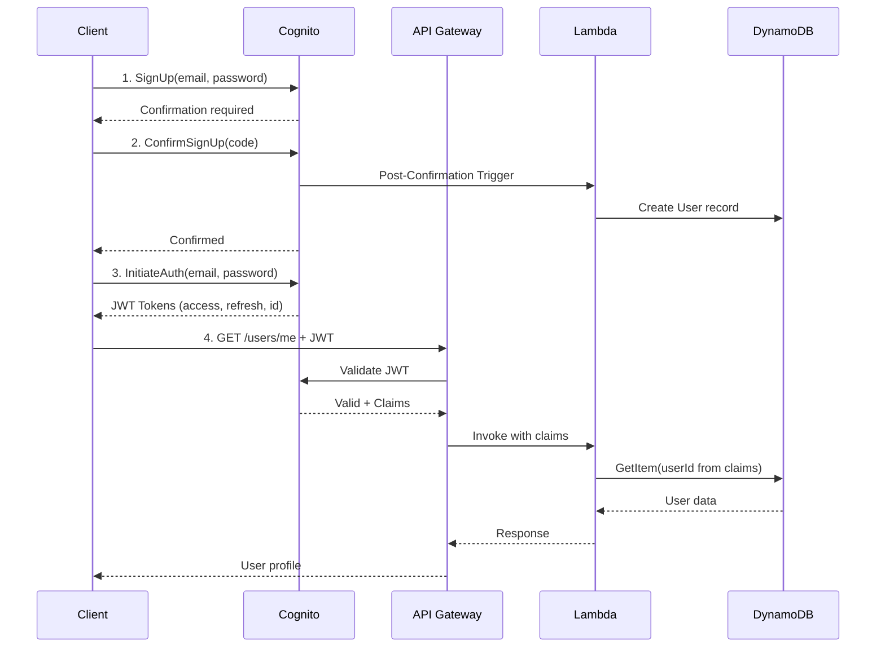

## Overview

AWS Cognito provides managed authentication with JWT tokens. The User Service integrates Cognito for:

- User registration and login
- Password management (reset, change)
- Email verification
- JWT token issuance and validation
- Optional MFA

## Architecture



## Cognito User Pool Configuration

### Basic Settings

| Setting | Value | Rationale |
|---------|-------|-----------|
| Sign-in options | Email only | Simpler UX, no username to remember |
| Email verification | Required | Ensure email ownership before use |
| Self-registration | Enabled | Users can sign up without admin |

### Password Policy

| Requirement | Value |
|-------------|-------|
| Minimum length | 12 characters |
| Require uppercase | Yes |
| Require lowercase | Yes |
| Require numbers | Yes |
| Require symbols | Yes |
| Temporary password validity | 7 days |

### MFA Configuration

| Setting | Value |
|---------|-------|
| MFA | Optional |
| Methods | TOTP (authenticator app) |
| Remember device | Enabled |

<Note>
MFA is optional to reduce friction during onboarding. High-value operations (like changing primary email) could require step-up authentication.
</Note>

## App Client Configuration

### OAuth 2.0 Settings

| Setting | Value |
|---------|-------|
| OAuth flows | Authorization code grant |
| Allowed OAuth scopes | openid, email, profile |
| Callback URLs | App-specific |
| Sign-out URLs | App-specific |

### Token Expiration

| Token | Expiration | Rationale |
|-------|------------|-----------|
| Access token | 1 hour | Short-lived for security |
| ID token | 1 hour | Contains user claims |
| Refresh token | 30 days | Long-lived for UX |

<Warning>
Access tokens cannot be revoked before expiry. Keep them short-lived. For immediate revocation needs, implement a token status check in Lambda.
</Warning>

## API Gateway Authorizer

### Cognito Authorizer Setup

The Cognito Authorizer validates JWT tokens automatically:

```yaml
# serverless.yml
functions:
  getMe:
    handler: src/handlers/user.getMe
    events:
      - http:
          path: /users/me
          method: get
          authorizer:
            type: COGNITO_USER_POOLS
            authorizerId: !Ref CognitoAuthorizer

resources:
  Resources:
    CognitoAuthorizer:
      Type: AWS::ApiGateway::Authorizer
      Properties:
        Name: CognitoAuthorizer
        Type: COGNITO_USER_POOLS
        IdentitySource: method.request.header.Authorization
        RestApiId: !Ref ApiGatewayRestApi
        ProviderARNs:
          - !GetAtt UserPool.Arn
```

### Extracting User Claims

In Lambda, user claims are available in the request context:

```typescript
interface APIGatewayEvent {
  requestContext: {
    authorizer: {
      claims: {
        sub: string;           // Cognito user ID (our userId)
        email: string;         // User's email
        email_verified: string; // "true" or "false"
        'cognito:username': string;
      }
    }
  }
}

const handler = async (event: APIGatewayEvent) => {
  const userId = event.requestContext.authorizer.claims.sub;
  // userId is guaranteed to be authentic - came from verified JWT
};
```

## User ID Strategy

### Option 1: Use Cognito `sub` (Recommended)

Use Cognito's `sub` claim directly as the userId in DynamoDB.

**Pros:**
- No mapping table needed
- Guaranteed unique
- Available in every token

**Cons:**
- UUID format, not human-readable
- Can't change if migrating away from Cognito

### Option 2: Custom User ID

Generate custom userId (e.g., nanoid) and store mapping.

**Pros:**
- Portable across auth providers
- Can use shorter IDs

**Cons:**
- Requires mapping table
- Extra lookup on every request

<Tip>
For most applications, using Cognito `sub` directly is simpler and sufficient. Only use custom IDs if you have a concrete migration plan.
</Tip>

## Cognito Triggers

### Post-Confirmation Trigger

When a user confirms their account, create the DynamoDB record:

```typescript
// src/triggers/postConfirmation.ts
export const handler = async (event: PostConfirmationTriggerEvent) => {
  const { sub, email } = event.request.userAttributes;
  
  await dynamodb.transactWrite({
    TransactItems: [
      {
        Put: {
          TableName: TABLE_NAME,
          Item: {
            PK: `USER#${sub}`,
            SK: 'PROFILE',
            email: email.toLowerCase(),
            status: 'active',
            version: 1,
            createdAt: new Date().toISOString(),
            updatedAt: new Date().toISOString(),
          }
        }
      },
      {
        Put: {
          TableName: TABLE_NAME,
          Item: {
            PK: `USER#${sub}`,
            SK: `EMAIL#${generateId()}`,
            GSI1PK: `EMAIL#${email.toLowerCase()}`,
            GSI1SK: `USER#${sub}`,
            email: email.toLowerCase(),
            isPrimary: true,
            isVerified: true,
            verifiedAt: new Date().toISOString(),
            createdAt: new Date().toISOString(),
          }
        }
      }
    ]
  });
  
  return event;
};
```

### Trigger Failure Recovery

<Warning>
Cognito triggers are synchronous. If the trigger fails, the user registration **succeeds in Cognito but fails in DynamoDB**, creating an orphaned Cognito user.
</Warning>

**Multi-layer failure handling:**

```typescript
export const handler = async (event: PostConfirmationTriggerEvent) => {
  const { sub, email } = event.request.userAttributes;
  const maxRetries = 3;
  
  for (let attempt = 1; attempt <= maxRetries; attempt++) {
    try {
      await createUserRecord(sub, email);
      logger.info('User record created', { sub, attempt });
      return event;
    } catch (error) {
      logger.warn('User creation failed', { sub, attempt, error: error.message });
      
      if (attempt < maxRetries) {
        await sleep(100 * Math.pow(2, attempt)); // Exponential backoff
        continue;
      }
      
      // Final attempt failed - queue for async retry
      await sqs.sendMessage({
        QueueUrl: FAILED_USER_CREATION_QUEUE,
        MessageBody: JSON.stringify({
          type: 'CREATE_USER_RECORD',
          payload: { sub, email },
          originalError: error.message,
          timestamp: new Date().toISOString()
        })
      });
      
      logger.error('User creation queued for retry', { sub });
    }
  }
  
  return event; // Must return event even on failure
};
```

**DLQ Processor:**

```typescript
// src/triggers/processFailedUserCreation.ts
export const handler = async (event: SQSEvent) => {
  for (const record of event.Records) {
    const { sub, email } = JSON.parse(record.body).payload;
    
    try {
      // Check if user already exists (idempotency)
      const existing = await getUser(sub);
      if (existing) {
        logger.info('User already exists, skipping', { sub });
        continue;
      }
      
      await createUserRecord(sub, email);
      logger.info('User record created from DLQ', { sub });
    } catch (error) {
      logger.error('DLQ processing failed', { sub, error: error.message });
      throw error; // Return to queue for retry
    }
  }
};
```

**Orphan Detection Job (Scheduled):**

For edge cases where both trigger and DLQ fail, run a periodic reconciliation:

```typescript
// src/scheduled/reconcileOrphanedUsers.ts
// Runs daily via EventBridge Scheduler

export const handler = async () => {
  // List Cognito users created in last 24 hours
  const cognitoUsers = await listRecentCognitoUsers(24);
  
  for (const cognitoUser of cognitoUsers) {
    const dynamoUser = await getUser(cognitoUser.sub);
    
    if (!dynamoUser) {
      logger.warn('Orphaned Cognito user detected', { 
        sub: cognitoUser.sub,
        email: cognitoUser.email 
      });
      
      // Option 1: Auto-create
      await createUserRecord(cognitoUser.sub, cognitoUser.email);
      
      // Option 2: Alert for manual review
      // await publishAlert('ORPHANED_USER', { sub: cognitoUser.sub });
    }
  }
};
```

<Note>
The reconciliation job is a safety net. In practice, the trigger + DLQ should handle 99.9%+ of cases. Monitor the reconciliation job's match rate - frequent orphans indicate a systemic issue.
</Note>

### Pre-Token Generation Trigger (Optional)

Inject custom claims into the token:

```typescript
export const handler = async (event: PreTokenGenerationTriggerEvent) => {
  const userId = event.request.userAttributes.sub;
  
  // Fetch user status from DynamoDB
  const user = await getUser(userId);
  
  event.response = {
    claimsOverrideDetails: {
      claimsToAddOrOverride: {
        'custom:status': user.status,
        'custom:tier': user.tier || 'free'
      }
    }
  };
  
  return event;
};
```

<Warning>
Pre-Token Generation adds latency to every token issuance. Only use if you need claims that change frequently and must be in the token.
</Warning>

## Token Revocation Strategy

### The Problem

JWT tokens are stateless. Once issued, they're valid until expiry. If a user is suspended or deleted, their existing tokens remain valid.

### Solution: Defense in Depth

<Steps>
  <Step title="Short Access Token TTL">
    1-hour access tokens limit exposure window
  </Step>
  <Step title="Status Check for Sensitive Operations">
    For high-risk operations, verify user status in DynamoDB before proceeding
  </Step>
  <Step title="Cognito Global Sign-Out">
    Invalidates all refresh tokens, forcing re-authentication
  </Step>
</Steps>

### Sensitive Operations Check

```typescript
const sensitiveOperationHandler = async (event: APIGatewayEvent) => {
  const userId = event.requestContext.authorizer.claims.sub;
  
  // Always check current status for sensitive ops
  const user = await getUser(userId);
  
  if (user.status !== 'active') {
    return {
      statusCode: 403,
      body: JSON.stringify({ error: 'Account suspended or deleted' })
    };
  }
  
  // Proceed with operation
};
```

## Security Considerations

### Never Trust Client-Provided User ID

```typescript
// WRONG - user could claim to be anyone
const userId = event.body.userId;

// CORRECT - extract from verified JWT
const userId = event.requestContext.authorizer.claims.sub;
```

### Email Enumeration Prevention

When checking if an email exists, return generic error:

```typescript
// WRONG - reveals valid emails
if (emailExists) {
  return { error: 'Email already registered' };
}

// CORRECT - generic message
return { error: 'Unable to complete registration' };
```

### Rate Limiting

Apply rate limits on sensitive Cognito operations:

| Operation | Limit |
|-----------|-------|
| Sign-up | 5/hour per IP |
| Login attempts | 5/minute per email |
| Password reset | 3/hour per email |
| Verification code resend | 3/hour per email |
