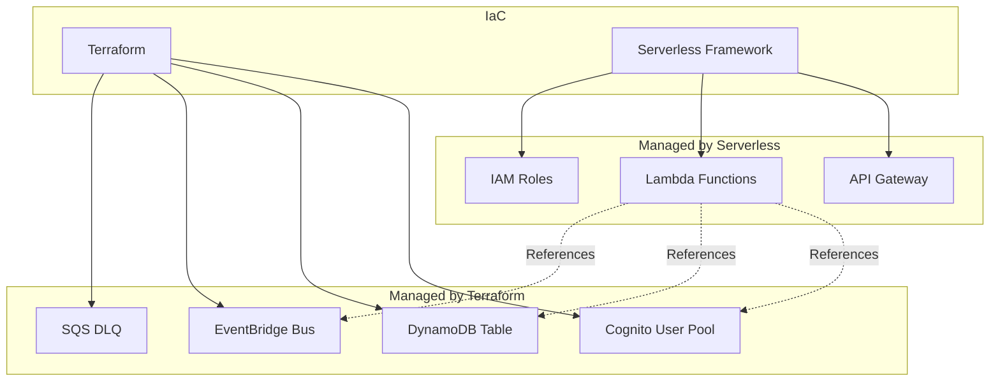
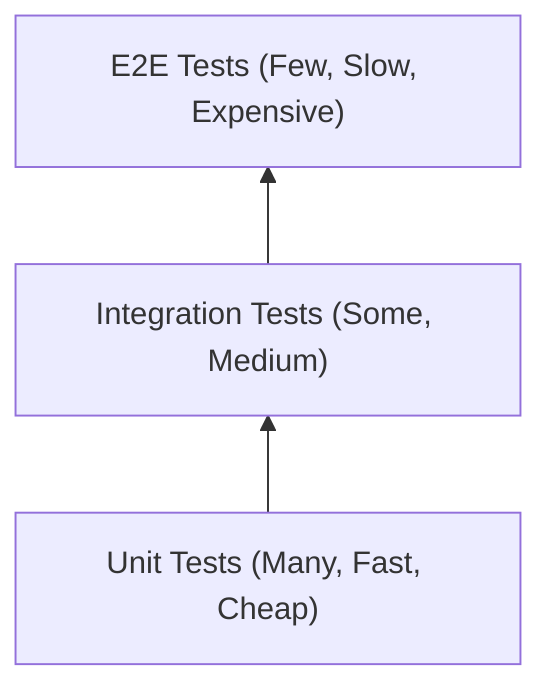
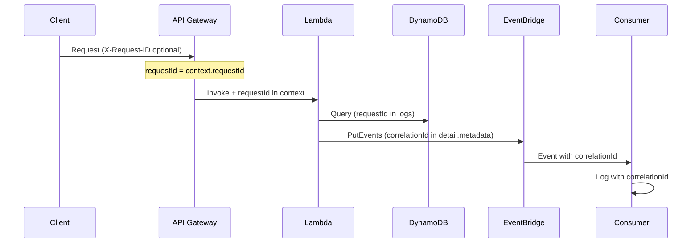

## Infrastructure Overview

The User Service infrastructure is managed through a combination of **Serverless Framework** (for Lambda and API Gateway) and **Terraform** (for shared resources like Cognito and DynamoDB).



## Terraform Resources

### Cognito User Pool

```hcl
resource "aws_cognito_user_pool" "main" {
  name = "${var.environment}-user-pool"

  username_attributes      = ["email"]
  auto_verified_attributes = ["email"]

  password_policy {
    minimum_length    = 12
    require_lowercase = true
    require_numbers   = true
    require_symbols   = true
    require_uppercase = true
  }

  schema {
    name                = "email"
    attribute_data_type = "String"
    required            = true
    mutable             = true
  }

  lambda_config {
    post_confirmation = aws_lambda_function.post_confirmation.arn
  }

  tags = var.common_tags
}

resource "aws_cognito_user_pool_client" "main" {
  name         = "${var.environment}-user-pool-client"
  user_pool_id = aws_cognito_user_pool.main.id

  generate_secret = false

  explicit_auth_flows = [
    "ALLOW_USER_PASSWORD_AUTH",
    "ALLOW_REFRESH_TOKEN_AUTH"
  ]

  access_token_validity  = 1   # hours
  id_token_validity      = 1   # hours
  refresh_token_validity = 30  # days
}
```

### DynamoDB Table

```hcl
resource "aws_dynamodb_table" "user_service" {
  name         = "${var.environment}-user-service"
  billing_mode = "PAY_PER_REQUEST"  # On-demand
  hash_key     = "PK"
  range_key    = "SK"

  attribute {
    name = "PK"
    type = "S"
  }

  attribute {
    name = "SK"
    type = "S"
  }

  attribute {
    name = "GSI1PK"
    type = "S"
  }

  attribute {
    name = "GSI1SK"
    type = "S"
  }

  global_secondary_index {
    name            = "GSI1"
    hash_key        = "GSI1PK"
    range_key       = "GSI1SK"
    projection_type = "ALL"
  }

  point_in_time_recovery {
    enabled = true
  }

  tags = var.common_tags
}
```

### EventBridge

```hcl
resource "aws_cloudwatch_event_bus" "user_service" {
  name = "${var.environment}-user-service"
  tags = var.common_tags
}

resource "aws_sqs_queue" "dlq" {
  name                      = "${var.environment}-user-service-dlq"
  message_retention_seconds = 1209600  # 14 days
  tags                      = var.common_tags
}

resource "aws_cloudwatch_event_rule" "user_events" {
  name           = "${var.environment}-user-events"
  event_bus_name = aws_cloudwatch_event_bus.user_service.name

  event_pattern = jsonencode({
    source      = ["user-service"]
    detail-type = [{ prefix = "user." }]
  })
}
```

## Serverless Framework

### serverless.yml

```yaml
service: user-service

provider:
  name: aws
  runtime: nodejs20.x
  stage: ${opt:stage, 'dev'}
  region: ${opt:region, 'us-east-1'}
  
  environment:
    TABLE_NAME: ${self:custom.tableName}
    EVENT_BUS_NAME: ${self:custom.eventBusName}
    COGNITO_USER_POOL_ID: ${self:custom.cognitoUserPoolId}
  
  iam:
    role:
      statements:
        - Effect: Allow
          Action:
            - dynamodb:GetItem
            - dynamodb:PutItem
            - dynamodb:UpdateItem
            - dynamodb:DeleteItem
            - dynamodb:Query
          Resource:
            - !Sub arn:aws:dynamodb:${AWS::Region}:${AWS::AccountId}:table/${self:custom.tableName}
            - !Sub arn:aws:dynamodb:${AWS::Region}:${AWS::AccountId}:table/${self:custom.tableName}/index/*
        - Effect: Allow
          Action:
            - events:PutEvents
          Resource:
            - !Sub arn:aws:events:${AWS::Region}:${AWS::AccountId}:event-bus/${self:custom.eventBusName}

custom:
  tableName: ${self:provider.stage}-user-service
  eventBusName: ${self:provider.stage}-user-service
  cognitoUserPoolId: ${ssm:/user-service/${self:provider.stage}/cognito-pool-id}

functions:
  getMe:
    handler: src/handlers/user.getMe
    events:
      - http:
          path: /users/me
          method: get
          authorizer:
            type: COGNITO_USER_POOLS
            authorizerId: !Ref CognitoAuthorizer

  updateMe:
    handler: src/handlers/user.updateMe
    events:
      - http:
          path: /users/me
          method: put
          authorizer:
            type: COGNITO_USER_POOLS
            authorizerId: !Ref CognitoAuthorizer

  deleteMe:
    handler: src/handlers/user.deleteMe
    events:
      - http:
          path: /users/me
          method: delete
          authorizer:
            type: COGNITO_USER_POOLS
            authorizerId: !Ref CognitoAuthorizer

  listEmails:
    handler: src/handlers/email.list
    events:
      - http:
          path: /users/me/emails
          method: get
          authorizer:
            type: COGNITO_USER_POOLS
            authorizerId: !Ref CognitoAuthorizer

  addEmail:
    handler: src/handlers/email.add
    events:
      - http:
          path: /users/me/emails
          method: post
          authorizer:
            type: COGNITO_USER_POOLS
            authorizerId: !Ref CognitoAuthorizer

  # Additional handlers...

resources:
  Resources:
    CognitoAuthorizer:
      Type: AWS::ApiGateway::Authorizer
      Properties:
        Name: CognitoAuthorizer
        Type: COGNITO_USER_POOLS
        IdentitySource: method.request.header.Authorization
        RestApiId: !Ref ApiGatewayRestApi
        ProviderARNs:
          - !Sub arn:aws:cognito-idp:${AWS::Region}:${AWS::AccountId}:userpool/${self:custom.cognitoUserPoolId}
```

## CI/CD Pipeline

### GitHub Actions Workflow

<Note>
This workflow uses **OIDC federation** instead of long-lived AWS access keys. OIDC is the recommended approach for GitHub Actions as it eliminates the need to store AWS credentials as secrets and provides short-lived, automatically rotated credentials.
</Note>

```yaml
name: Deploy User Service

on:
  push:
    branches: [main]
  pull_request:
    branches: [main]

permissions:
  id-token: write   # Required for OIDC
  contents: read

jobs:
  test:
    runs-on: ubuntu-latest
    steps:
      - uses: actions/checkout@v4
      
      - uses: actions/setup-node@v4
        with:
          node-version: '20'
          cache: 'npm'
      
      - run: npm ci
      - run: npm run lint
      - run: npm run typecheck
      - run: npm test

  deploy-staging:
    needs: test
    if: github.ref == 'refs/heads/main'
    runs-on: ubuntu-latest
    environment: staging
    steps:
      - uses: actions/checkout@v4
      
      - uses: actions/setup-node@v4
        with:
          node-version: '20'
          cache: 'npm'
      
      - name: Configure AWS Credentials (OIDC)
        uses: aws-actions/configure-aws-credentials@v4
        with:
          role-to-assume: arn:aws:iam::${{ secrets.AWS_ACCOUNT_ID }}:role/github-actions-deploy
          aws-region: us-east-1
      
      - run: npm ci
      
      - name: Deploy to Staging
        run: npx serverless deploy --stage staging

  integration-test:
    needs: deploy-staging
    runs-on: ubuntu-latest
    steps:
      - uses: actions/checkout@v4
      - run: npm ci
      - run: npm run test:integration
        env:
          API_URL: ${{ secrets.STAGING_API_URL }}
          TEST_USER_EMAIL: ${{ secrets.TEST_USER_EMAIL }}
          TEST_USER_PASSWORD: ${{ secrets.TEST_USER_PASSWORD }}

  deploy-production:
    needs: integration-test
    runs-on: ubuntu-latest
    environment: 
      name: production
      url: https://api.example.com
    steps:
      - uses: actions/checkout@v4
      
      - uses: actions/setup-node@v4
        with:
          node-version: '20'
          cache: 'npm'
      
      - name: Configure AWS Credentials (OIDC)
        uses: aws-actions/configure-aws-credentials@v4
        with:
          role-to-assume: arn:aws:iam::${{ secrets.AWS_ACCOUNT_ID }}:role/github-actions-deploy
          aws-region: us-east-1
      
      - run: npm ci
      
      - name: Deploy to Production
        run: npx serverless deploy --stage prod
```

### OIDC IAM Role Setup

The GitHub Actions OIDC provider must be configured in AWS:

```hcl
# terraform/github-oidc.tf
resource "aws_iam_openid_connect_provider" "github" {
  url             = "https://token.actions.githubusercontent.com"
  client_id_list  = ["sts.amazonaws.com"]
  thumbprint_list = ["6938fd4d98bab03faadb97b34396831e3780aea1"]
}

resource "aws_iam_role" "github_actions" {
  name = "github-actions-deploy"

  assume_role_policy = jsonencode({
    Version = "2012-10-17"
    Statement = [{
      Effect = "Allow"
      Principal = {
        Federated = aws_iam_openid_connect_provider.github.arn
      }
      Action = "sts:AssumeRoleWithWebIdentity"
      Condition = {
        StringEquals = {
          "token.actions.githubusercontent.com:aud" = "sts.amazonaws.com"
        }
        StringLike = {
          "token.actions.githubusercontent.com:sub" = "repo:esakrissa/user-service:*"
        }
      }
    }]
  })
}
```

### Pipeline Stages

<Steps>
  <Step title="PR Checks">
    Lint, type-check, unit tests on every pull request
  </Step>
  <Step title="Deploy Staging">
    Automatic deployment to staging on merge to main
  </Step>
  <Step title="Integration Tests">
    Run integration tests against staging environment
  </Step>
  <Step title="Deploy Production">
    Manual approval required, then deploy to production
  </Step>
</Steps>

## Monitoring

### CloudWatch Metrics

| Metric | Source | Alarm Threshold |
|--------|--------|-----------------|
| Lambda Errors | Lambda | Error rate > 1% |
| Lambda Duration | Lambda | p99 > 3 seconds |
| API Gateway 5xx | API Gateway | > 10 per minute |
| API Gateway 4xx | API Gateway | > 100 per minute (warning) |
| DynamoDB Throttles | DynamoDB | Any throttle |
| DynamoDB ConsumedRCU | DynamoDB | > 80% of limit |
| DLQ Messages | SQS | Visible messages > 0 |

### CloudWatch Dashboard

```json
{
  "widgets": [
    {
      "type": "metric",
      "properties": {
        "title": "Lambda Invocations & Errors",
        "metrics": [
          ["AWS/Lambda", "Invocations", "FunctionName", "user-service-prod-getMe"],
          [".", "Errors", ".", "."]
        ]
      }
    },
    {
      "type": "metric", 
      "properties": {
        "title": "API Gateway Latency",
        "metrics": [
          ["AWS/ApiGateway", "Latency", "ApiName", "prod-user-service", { "stat": "p50" }],
          ["...", { "stat": "p99" }]
        ]
      }
    },
    {
      "type": "metric",
      "properties": {
        "title": "DynamoDB Consumed Capacity",
        "metrics": [
          ["AWS/DynamoDB", "ConsumedReadCapacityUnits", "TableName", "prod-user-service"],
          [".", "ConsumedWriteCapacityUnits", ".", "."]
        ]
      }
    }
  ]
}
```

### X-Ray Tracing

Enable distributed tracing across services:

```yaml
# serverless.yml
provider:
  tracing:
    lambda: true
    apiGateway: true
```

X-Ray provides:
- End-to-end request traces
- Service map visualization
- Latency breakdown by component
- Error correlation across services

## Scaling Considerations

### Lambda Cold Starts

| Strategy | When to Use |
|----------|-------------|
| **Provisioned Concurrency** | Latency-sensitive endpoints, consistent traffic |
| **Keep functions small** | Always - faster cold starts |
| **Warm-up pings** | Budget-conscious, occasional latency spikes acceptable |

### DynamoDB Capacity

| Mode | Traffic Pattern | Cost Model |
|------|-----------------|------------|
| **On-Demand** | Unpredictable, spiky | Pay per request |
| **Provisioned** | Predictable, steady | Pay for capacity |
| **Provisioned + Auto-scaling** | Predictable with occasional spikes | Pay for capacity, auto-adjusts |

<Tip>
Start with on-demand. After collecting 2-4 weeks of metrics, evaluate if provisioned capacity would be more cost-effective.
</Tip>

### API Gateway Throttling

| Setting | Default | Recommended |
|---------|---------|-------------|
| Account-level rate | 10,000 RPS | Sufficient for most |
| Per-method throttle | None | Set based on expected traffic |
| Usage plans | None | Implement for B2B API access |

### GSI Hot Partitions

**Risk:** If many users have similar email domains, GSI partition key `EMAIL#{email}` could create hot partitions.

**Mitigation:**
- Email addresses are naturally distributed
- Monitor `ConsumedReadCapacityUnits` by partition key
- If issues arise, consider write sharding for high-volume patterns

---

## Cost Analysis

Understanding costs at different scales helps with capacity planning and budget forecasting.

### Cost Breakdown by Scale

| Component | 10K MAU | 100K MAU | 1M MAU |
|-----------|---------|----------|--------|
| **Lambda** | ~$2/mo | ~$15/mo | ~$120/mo |
| **API Gateway** | ~$4/mo | ~$35/mo | ~$350/mo |
| **DynamoDB (on-demand)** | ~$3/mo | ~$25/mo | ~$200/mo |
| **Cognito** | Free (first 50K) | ~$275/mo | ~$2,750/mo |
| **EventBridge** | ~$0.10/mo | ~$1/mo | ~$10/mo |
| **CloudWatch Logs** | ~$2/mo | ~$15/mo | ~$100/mo |
| **Total** | **~$11/mo** | **~$366/mo** | **~$3,530/mo** |

<Note>
MAU = Monthly Active Users. Assumes average 10 API calls per user per month, 1KB average payload. Cognito is the largest cost driver at scale due to per-MAU pricing ($0.0055/MAU after 50K free tier).
</Note>

### Cost Assumptions

| Metric | Value |
|--------|-------|
| Average Lambda duration | 100ms |
| Lambda memory | 256MB |
| DynamoDB item size | 500 bytes average |
| API calls per user/month | 10 |
| Events published per user/month | 2 |

### Cost Optimization Strategies

<AccordionGroup>
  <Accordion title="DynamoDB: On-Demand vs Provisioned">
    Switch to provisioned capacity with auto-scaling when traffic is predictable. Can reduce costs by 50-70% at steady state.
    
    **Break-even:** ~25% capacity utilization. If you're consistently above this, provisioned is cheaper.
  </Accordion>
  
  <Accordion title="Cognito Alternatives">
    At 1M+ users, consider self-managed auth (e.g., Auth0, or custom JWT issuance). Cognito's per-MAU pricing becomes expensive.
    
    **Trade-off:** Operational complexity vs. cost savings
  </Accordion>
  
  <Accordion title="Lambda: Reduce Cold Starts">
    Use Graviton2 (ARM) processors for 20% cost reduction. Smaller bundles reduce cold start time and execution cost.
  </Accordion>
</AccordionGroup>

---

## Testing Strategy

A comprehensive testing approach ensures reliability without slowing down development.

### Testing Pyramid



### Unit Tests

**Tools:** Jest, ts-jest

**What to test:**
- Business logic in isolation (validation, transformations)
- DynamoDB marshalling/unmarshalling
- Error handling paths

```typescript
// Example: Email validation
describe('normalizeEmail', () => {
  it('lowercases email', () => {
    expect(normalizeEmail('John@Example.COM')).toBe('john@example.com');
  });
  
  it('trims whitespace', () => {
    expect(normalizeEmail('  john@example.com  ')).toBe('john@example.com');
  });
});
```

### Integration Tests

**Tools:** Jest, DynamoDB Local, LocalStack

**What to test:**
- Lambda handlers with real DynamoDB operations
- Cognito trigger flows
- EventBridge event publishing

```typescript
// Example: Handler integration test
describe('getMe handler', () => {
  beforeAll(async () => {
    await createTestTable();
    await seedTestUser();
  });
  
  it('returns user profile for valid JWT', async () => {
    const event = mockApiGatewayEvent({
      path: '/users/me',
      claims: { sub: 'test-user-id' }
    });
    
    const response = await handler(event);
    
    expect(response.statusCode).toBe(200);
    expect(JSON.parse(response.body).userId).toBe('test-user-id');
  });
});
```

### Contract Tests

**Tools:** Pact, EventBridge Schema Registry

**What to test:**
- Event schemas match consumer expectations
- API response shapes are stable

### E2E Tests

**Tools:** Cypress, Playwright (for full-stack), or custom scripts

**What to test:**
- Full user registration flow
- Critical paths (login → action → logout)

<Warning>
E2E tests are expensive to maintain. Keep them minimal and focused on critical business flows. Most coverage should come from unit and integration tests.
</Warning>

### Test Commands

```bash
npm run test          # Unit tests (fast, run on every commit)
npm run test:int      # Integration tests (requires DynamoDB Local)
npm run test:e2e      # E2E tests (run against staging)
npm run test:all      # Full suite
```

---

## Observability Correlation

Tracing requests across API Gateway, Lambda, DynamoDB, and EventBridge requires consistent correlation IDs.

### Request ID Flow



### Implementation

**Lambda middleware for correlation:**

```typescript
interface RequestContext {
  requestId: string;
  userId?: string;
}

const withCorrelation = (handler: Handler) => async (event: APIGatewayEvent) => {
  const requestId = event.requestContext.requestId;
  const userId = event.requestContext.authorizer?.claims?.sub;
  
  // Attach to all logs
  logger.setContext({ requestId, userId });
  
  try {
    return await handler(event, { requestId, userId });
  } finally {
    logger.clearContext();
  }
};
```

**EventBridge event with correlation:**

```typescript
await eventbridge.putEvents({
  Entries: [{
    Source: 'user-service',
    DetailType: 'user.updated',
    Detail: JSON.stringify({
      userId,
      changedFields,
      metadata: {
        correlationId: context.requestId,  // Links back to API request
        timestamp: new Date().toISOString(),
        environment: process.env.STAGE
      }
    })
  }]
});
```

**CloudWatch Logs Insights query:**

```sql
fields @timestamp, @message
| filter metadata.correlationId = 'abc-123-request-id'
| sort @timestamp asc
```

### Structured Logging

All logs use JSON format for queryability:

```typescript
logger.info('User updated', {
  requestId: context.requestId,
  userId,
  changedFields: ['firstName', 'lastName'],
  duration: 45
});
```

Output:
```json
{
  "level": "info",
  "message": "User updated",
  "requestId": "abc-123",
  "userId": "user-456",
  "changedFields": ["firstName", "lastName"],
  "duration": 45,
  "timestamp": "2026-01-21T10:30:00.000Z"
}
```
