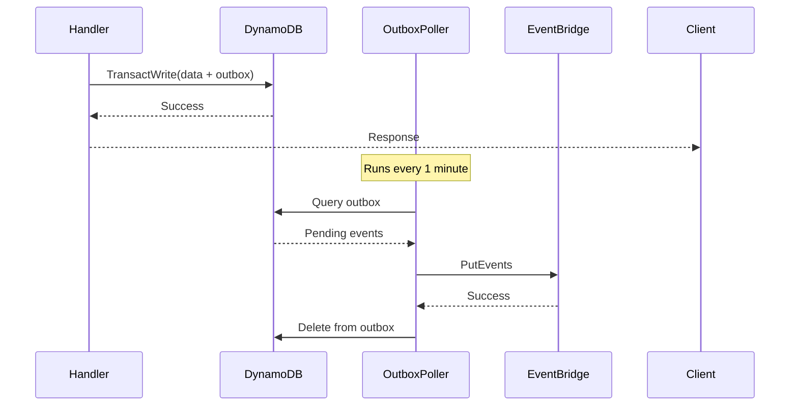

## Overview

Every distributed system has inherent challenges. This section consolidates the hard problems encountered in the User Service design and their solutions.

## Challenge Summary

| Area | Challenge | Solution | Trade-off |
|------|-----------|----------|-----------|
| Data | Email uniqueness | GSI + conditional writes | Extra query before insert |
| Data | Primary email invariant | TransactWriteItems | Transaction overhead |
| Data | Concurrent updates | Optimistic locking | Retry on conflict |
| Auth | Cognito-DynamoDB sync | Triggers + compensation | Eventual consistency |
| Auth | Token revocation | Short TTL + status check | Extra DB read for sensitive ops |
| Events | Ordering | Timestamps + idempotency | Complexity in consumers |
| Events | Delivery guarantee | Outbox pattern | Additional infrastructure |
| Scale | GSI hot partitions | Monitor + shard if needed | Complexity if triggered |

---

## Data Layer Challenges

### Email Uniqueness

<Card title="The Problem" icon="triangle-exclamation">
DynamoDB has no native UNIQUE constraint. Two concurrent requests could add the same email address.
</Card>

**Solution: GSI + Conditional Writes**

```typescript
async function addEmail(userId: string, email: string): Promise<void> {
  const normalizedEmail = email.toLowerCase().trim();
  
  // Step 1: Check if email exists
  const existing = await dynamodb.query({
    TableName: TABLE_NAME,
    IndexName: 'GSI1',
    KeyConditionExpression: 'GSI1PK = :pk',
    ExpressionAttributeValues: {
      ':pk': `EMAIL#${normalizedEmail}`
    },
    Limit: 1
  });
  
  if (existing.Items?.length > 0) {
    throw new ConflictError('Email not available');
  }
  
  // Step 2: Conditional write
  await dynamodb.put({
    TableName: TABLE_NAME,
    Item: {
      PK: `USER#${userId}`,
      SK: `EMAIL#${generateId()}`,
      GSI1PK: `EMAIL#${normalizedEmail}`,
      GSI1SK: `USER#${userId}`,
      email: normalizedEmail,
      // ... other fields
    },
    ConditionExpression: 'attribute_not_exists(PK)'
  });
}
```

**Race Condition Handling:**

Even with the query, a race condition exists between check and write. The conditional expression catches this:

```typescript
try {
  await addEmail(userId, email);
} catch (error) {
  if (error.name === 'ConditionalCheckFailedException') {
    throw new ConflictError('Email not available');
  }
  throw error;
}
```

---

### Primary Email Invariant

<Card title="The Problem" icon="triangle-exclamation">
Exactly one email must be primary per user. Changing primary requires updating two records atomically.
</Card>

**Solution: TransactWriteItems**

```typescript
async function setPrimaryEmail(
  userId: string, 
  newPrimaryEmailId: string,
  currentPrimaryEmailId: string
): Promise<void> {
  const newEmailItem = await getEmail(userId, newPrimaryEmailId);
  
  if (!newEmailItem.isVerified) {
    throw new BadRequestError('Email must be verified');
  }
  
  await dynamodb.transactWrite({
    TransactItems: [
      // Unset current primary
      {
        Update: {
          TableName: TABLE_NAME,
          Key: {
            PK: `USER#${userId}`,
            SK: `EMAIL#${currentPrimaryEmailId}`
          },
          UpdateExpression: 'SET isPrimary = :false',
          ExpressionAttributeValues: { ':false': false }
        }
      },
      // Set new primary
      {
        Update: {
          TableName: TABLE_NAME,
          Key: {
            PK: `USER#${userId}`,
            SK: `EMAIL#${newPrimaryEmailId}`
          },
          UpdateExpression: 'SET isPrimary = :true',
          ExpressionAttributeValues: { ':true': true },
          ConditionExpression: 'isVerified = :true'
        }
      },
      // Update user profile
      {
        Update: {
          TableName: TABLE_NAME,
          Key: {
            PK: `USER#${userId}`,
            SK: 'PROFILE'
          },
          UpdateExpression: 'SET email = :email, GSI1PK = :gsi1pk, updatedAt = :now',
          ExpressionAttributeValues: {
            ':email': newEmailItem.email,
            ':gsi1pk': `EMAIL#${newEmailItem.email}`,
            ':now': new Date().toISOString()
          }
        }
      }
    ]
  });
}
```

**Why TransactWriteItems?**
- All-or-nothing: If any operation fails, none are applied
- Condition checks: Can verify preconditions atomically
- Up to 100 items per transaction

---

### Concurrent Updates

<Card title="The Problem" icon="triangle-exclamation">
Two requests update the same user simultaneously, causing lost updates.
</Card>

**Solution: Optimistic Locking**

```typescript
async function updateUser(
  userId: string, 
  updates: Partial<UserProfile>,
  expectedVersion: number
): Promise<UserProfile> {
  try {
    const result = await dynamodb.update({
      TableName: TABLE_NAME,
      Key: {
        PK: `USER#${userId}`,
        SK: 'PROFILE'
      },
      UpdateExpression: `
        SET firstName = :firstName,
            lastName = :lastName,
            phone = :phone,
            version = version + :inc,
            updatedAt = :now
      `,
      ConditionExpression: 'version = :expectedVersion',
      ExpressionAttributeValues: {
        ':firstName': updates.firstName,
        ':lastName': updates.lastName,
        ':phone': updates.phone,
        ':inc': 1,
        ':expectedVersion': expectedVersion,
        ':now': new Date().toISOString()
      },
      ReturnValues: 'ALL_NEW'
    });
    
    return result.Attributes as UserProfile;
  } catch (error) {
    if (error.name === 'ConditionalCheckFailedException') {
      throw new ConflictError('Resource modified, please refresh');
    }
    throw error;
  }
}
```

---

## Authentication Challenges

### Cognito-DynamoDB Sync

<Card title="The Problem" icon="triangle-exclamation">
User registers in Cognito, but DynamoDB record creation fails. User exists in Cognito but not in application.
</Card>

**Solution: Post-Confirmation Trigger with Retry**

```typescript
export const postConfirmation = async (
  event: PostConfirmationTriggerEvent
): Promise<PostConfirmationTriggerEvent> => {
  const { sub, email } = event.request.userAttributes;
  
  const maxRetries = 3;
  let attempt = 0;
  
  while (attempt < maxRetries) {
    try {
      await createUserRecord(sub, email);
      return event;
    } catch (error) {
      attempt++;
      if (attempt === maxRetries) {
        // Log for manual intervention
        console.error('Failed to create user record', { sub, email, error });
        
        // Publish to DLQ for retry
        await sqs.sendMessage({
          QueueUrl: DLQ_URL,
          MessageBody: JSON.stringify({
            type: 'CREATE_USER_RECORD',
            payload: { sub, email }
          })
        });
      }
      await sleep(100 * Math.pow(2, attempt)); // Exponential backoff
    }
  }
  
  return event; // Must return event even on failure
};
```

**Compensating Action:**

A separate Lambda processes the DLQ and retries user creation:

```typescript
export const processFailedUserCreation = async (event: SQSEvent) => {
  for (const record of event.Records) {
    const { sub, email } = JSON.parse(record.body).payload;
    
    try {
      await createUserRecord(sub, email);
      // Success - message auto-deleted
    } catch (error) {
      // Return message to queue for retry
      throw error;
    }
  }
};
```

---

### Token Revocation

<Card title="The Problem" icon="triangle-exclamation">
JWT access tokens cannot be revoked. A suspended user's token remains valid until expiry.
</Card>

**Solution: Layered Defense**

<Steps>
  <Step title="Short TTL">
    Access tokens expire in 1 hour, limiting exposure window
  </Step>
  <Step title="Status Check">
    For sensitive operations, verify user status in DynamoDB
  </Step>
  <Step title="Global Sign-Out">
    Invalidate all refresh tokens when user is suspended
  </Step>
</Steps>

```typescript
// Middleware for sensitive operations
async function requireActiveUser(
  event: APIGatewayEvent
): Promise<void> {
  const userId = event.requestContext.authorizer.claims.sub;
  
  const user = await dynamodb.get({
    TableName: TABLE_NAME,
    Key: { PK: `USER#${userId}`, SK: 'PROFILE' },
    ProjectionExpression: 'status'
  });
  
  if (user.Item?.status !== 'active') {
    throw new ForbiddenError('Account is not active');
  }
}

// When suspending a user
async function suspendUser(userId: string): Promise<void> {
  // Update DynamoDB
  await updateUserStatus(userId, 'suspended');
  
  // Invalidate all Cognito sessions
  await cognito.adminUserGlobalSignOut({
    UserPoolId: USER_POOL_ID,
    Username: userId
  });
  
  // Publish event
  await publishEvent('user.suspended', { userId });
}
```

---

## Event Layer Challenges

### Event Ordering

<Card title="The Problem" icon="triangle-exclamation">
Events may arrive out of order. `user.updated` could arrive before `user.created`.
</Card>

**Solution: Timestamps + Idempotent Consumers**

```typescript
interface UserEvent {
  userId: string;
  timestamp: string;  // ISO8601
  eventId: string;    // For deduplication
}

async function handleUserEvent(event: UserEvent): Promise<void> {
  // Check if we've processed this event
  const processed = await isEventProcessed(event.eventId);
  if (processed) {
    console.log('Duplicate event, skipping');
    return;
  }
  
  // Get current state
  const current = await getLocalUserState(event.userId);
  
  // Ignore if we have newer data
  if (current && current.lastEventTimestamp > event.timestamp) {
    console.log('Stale event, skipping');
    return;
  }
  
  // Process event
  await updateLocalUserState(event);
  
  // Mark as processed
  await markEventProcessed(event.eventId);
}
```

**Alternative: SQS FIFO**

For strict ordering requirements:
- Use SQS FIFO queue with MessageGroupId = userId
- Trade-off: Lower throughput (3,000 messages/second with batching)

---

### Guaranteed Delivery

<Card title="The Problem" icon="triangle-exclamation">
DynamoDB write succeeds, but EventBridge publish fails. Event is lost.
</Card>

**Solution: Transactional Outbox Pattern**



```typescript
// In handler - atomic write
await dynamodb.transactWrite({
  TransactItems: [
    {
      Put: {
        TableName: TABLE_NAME,
        Item: updatedUser
      }
    },
    {
      Put: {
        TableName: OUTBOX_TABLE,
        Item: {
          PK: `OUTBOX#${Date.now()}`,
          SK: eventId,
          eventType: 'user.updated',
          payload: JSON.stringify(eventPayload),
          createdAt: new Date().toISOString()
        }
      }
    }
  ]
});

// Outbox poller Lambda
export const pollOutbox = async (): Promise<void> => {
  const events = await queryOutbox();
  
  for (const event of events) {
    await eventbridge.putEvents({
      Entries: [{
        Source: 'user-service',
        DetailType: event.eventType,
        Detail: event.payload,
        EventBusName: EVENT_BUS_NAME
      }]
    });
    
    await deleteFromOutbox(event.PK, event.SK);
  }
};
```

<Warning>
The outbox pattern adds complexity. Only use when event delivery is business-critical. For many use cases, at-least-once delivery with idempotent consumers is sufficient.
</Warning>

---

## What Makes This "Good"

<CardGroup cols={2}>
  <Card title="Defense in Depth" icon="shield">
    Multiple layers of protection: JWT validation, status checks, conditional writes
  </Card>
  <Card title="Explicit Trade-offs" icon="scale-balanced">
    Each solution documents what we gain and what we sacrifice
  </Card>
  <Card title="Failure Handling" icon="rotate">
    Every failure mode has a recovery path: retries, DLQ, compensation
  </Card>
  <Card title="Observable" icon="eye">
    Structured logging, tracing, and metrics at every decision point
  </Card>
</CardGroup>

---

## Questions to Ask

When reviewing this design, consider:

1. **What's the blast radius?** If X fails, what else breaks?
2. **Can we recover?** For every failure, is there a path back to consistency?
3. **What's the latency impact?** Extra DB reads, transaction overhead, network hops
4. **Is it worth it?** Does the complexity match the business criticality?
