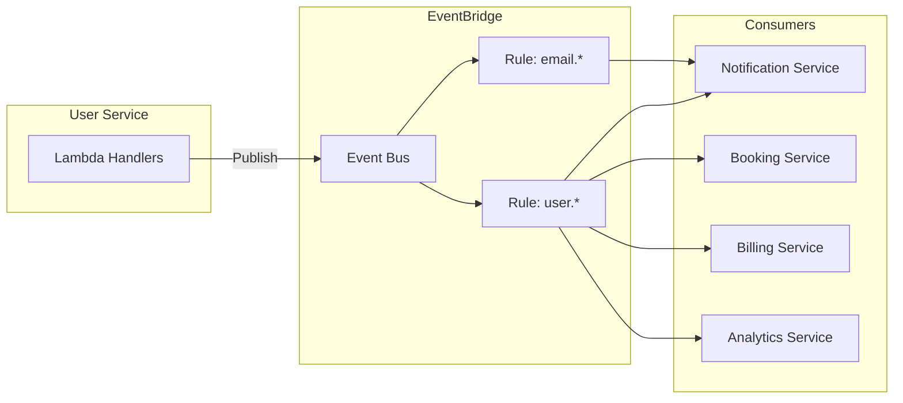
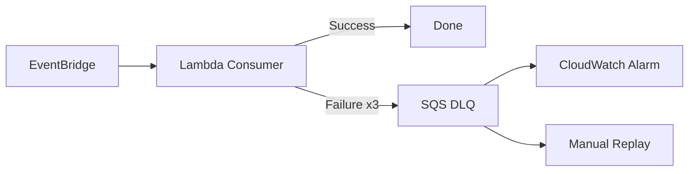

## Overview

The User Service communicates with other services via **Amazon EventBridge**, a serverless event bus. This provides loose coupling, enabling services to react to user lifecycle events without direct dependencies.



## Why EventBridge?

| Requirement | EventBridge | SQS |
|-------------|-------------|-----|
| One event → multiple consumers | Native fan-out | Requires SNS+SQS or multiple queues |
| Event filtering | Rules with pattern matching | Limited (message attributes) |
| Schema management | Schema Registry | Manual |
| Audit trail | Archive and replay | Manual implementation |
| Cross-account | Native support | Requires configuration |

<Note>
SQS is ideal for point-to-point messaging or work queues. EventBridge is better for event-driven architectures where multiple services react to the same event.
</Note>

## Events Published

### User Events

| Event Type | Trigger | Payload |
|------------|---------|---------|
| `user.created` | Post-confirmation trigger | userId, email, timestamp |
| `user.updated` | Profile update | userId, changedFields, timestamp |
| `user.deleted` | Account deletion | userId, timestamp |
| `user.suspended` | Admin action | userId, reason, timestamp |
| `user.reactivated` | Admin action | userId, timestamp |

### Email Events

| Event Type | Trigger | Payload |
|------------|---------|---------|
| `email.added` | New email added | userId, emailId, email |
| `email.verified` | Verification confirmed | userId, emailId, email |
| `email.removed` | Email deleted | userId, emailId, email |
| `email.primary.changed` | Primary email changed | userId, oldEmail, newEmail |

## Event Schema

All events follow a consistent envelope:

```json
{
  "version": "1.0",
  "source": "user-service",
  "detail-type": "user.created",
  "time": "2024-01-21T10:30:00Z",
  "detail": {
    "userId": "abc-123-def",
    "email": "john@example.com",
    "metadata": {
      "correlationId": "req-xyz-789",
      "environment": "production"
    }
  }
}
```

### Schema Fields

| Field | Type | Description |
|-------|------|-------------|
| `version` | string | Schema version for evolution |
| `source` | string | Publishing service identifier |
| `detail-type` | string | Event type (domain.action format) |
| `time` | ISO8601 | Event timestamp |
| `detail` | object | Event-specific payload |
| `detail.metadata.correlationId` | string | Request tracing ID |

<Tip>
Always include `version` in events. Consumers can handle multiple versions during migration periods.
</Tip>

## Event Consumers

### Who Subscribes to What?

| Service | Events | Purpose |
|---------|--------|---------|
| Notification | `user.created`, `email.added`, `email.verified`, `email.primary.changed` | Send welcome emails, verification codes, confirmations |
| Booking | `user.deleted`, `user.suspended` | Cancel pending bookings, block new bookings |
| Billing | `user.deleted`, `email.primary.changed` | Final invoice, update billing contact |
| Analytics | `user.*`, `email.*` | Usage tracking, conversion funnels |
| Search Index | `user.updated`, `user.deleted` | Keep search index in sync |

### EventBridge Rules

```json
{
  "Rule": "UserEventsToNotification",
  "EventPattern": {
    "source": ["user-service"],
    "detail-type": [
      "user.created",
      "email.added", 
      "email.verified",
      "email.primary.changed"
    ]
  },
  "Targets": [{
    "Arn": "arn:aws:lambda:...:notification-handler"
  }]
}
```

## Events Consumed

The User Service also consumes events from other services:

| Event | Source | Action |
|-------|--------|--------|
| `cognito.user.confirmed` | Cognito (via trigger) | Create DynamoDB user record |
| `billing.subscription.changed` | Billing Service | Update user tier/status |
| `admin.user.suspend` | Admin Service | Set user status to suspended |

## Hard Parts

### Event Ordering

**Problem:** Events may arrive out of order. `user.updated` might arrive before `user.created`.

**Solution:** 

1. **Timestamps:** Every event includes `time`. Consumers can discard stale events.
2. **Idempotent handlers:** Operations should be safe to retry or reorder.
3. **Last-write-wins:** For non-critical data, accept the latest timestamp.

```typescript
const handleUserUpdate = async (event: UserUpdatedEvent) => {
  const existing = await getLocalUser(event.detail.userId);
  
  // Ignore if we have newer data
  if (existing && existing.updatedAt > event.time) {
    console.log('Ignoring stale event');
    return;
  }
  
  await updateLocalUser(event.detail);
};
```

### Eventual Consistency

**Problem:** After `user.deleted`, other services may still show the user briefly.

**Solution:**

1. **Accept it:** Most use cases tolerate seconds of delay.
2. **Critical path queries:** For operations that cannot tolerate stale data, query the source service directly.

```typescript
const createBooking = async (userId: string) => {
  // Critical operation - verify user status directly
  const user = await userServiceClient.getUser(userId);
  
  if (user.status !== 'active') {
    throw new Error('Cannot create booking for inactive user');
  }
  
  // Proceed with booking
};
```

### Failed Event Processing

**Problem:** Consumer fails to process an event (bug, downstream outage).

**Solution:** Dead Letter Queue (DLQ) with alerting and replay capability.



**DLQ Configuration:**
- Max retries: 3 (with exponential backoff)
- DLQ retention: 14 days
- Alarm on DLQ depth > 0

### Guaranteed Delivery

**Problem:** Lambda publishes to DynamoDB but EventBridge call fails. Event is lost.

**Solution:** Transactional Outbox Pattern

<Steps>
  <Step title="Write to Outbox">
    In the same DynamoDB transaction, write the event to an outbox table
  </Step>
  <Step title="Async Publisher">
    Separate Lambda polls outbox (or uses DynamoDB Streams) and publishes to EventBridge
  </Step>
  <Step title="Delete from Outbox">
    After successful publish, delete from outbox
  </Step>
</Steps>

```typescript
// In the main handler
await dynamodb.transactWrite({
  TransactItems: [
    {
      Put: {
        TableName: 'UserTable',
        Item: updatedUser
      }
    },
    {
      Put: {
        TableName: 'OutboxTable',
        Item: {
          PK: `EVENT#${eventId}`,
          eventType: 'user.updated',
          payload: JSON.stringify(eventPayload),
          createdAt: new Date().toISOString()
        }
      }
    }
  ]
});
```

<Warning>
The outbox pattern adds complexity. Only use it when event delivery is truly critical. For many use cases, at-least-once delivery with idempotent consumers is sufficient.
</Warning>

## Schema Evolution

### Adding Fields

New fields can be added without breaking consumers:

```json
// v1.0
{ "userId": "123", "email": "a@b.com" }

// v1.1 - backwards compatible
{ "userId": "123", "email": "a@b.com", "tier": "premium" }
```

### Changing Fields

For breaking changes:

1. Increment version
2. Publish both versions during transition
3. Consumers upgrade to new version
4. Stop publishing old version

### EventBridge Schema Registry

Register schemas for documentation and validation:

```json
{
  "openapi": "3.0.0",
  "info": {
    "title": "UserService.user.created",
    "version": "1.0"
  },
  "components": {
    "schemas": {
      "UserCreated": {
        "type": "object",
        "required": ["userId", "email"],
        "properties": {
          "userId": { "type": "string", "format": "uuid" },
          "email": { "type": "string", "format": "email" }
        }
      }
    }
  }
}
```
